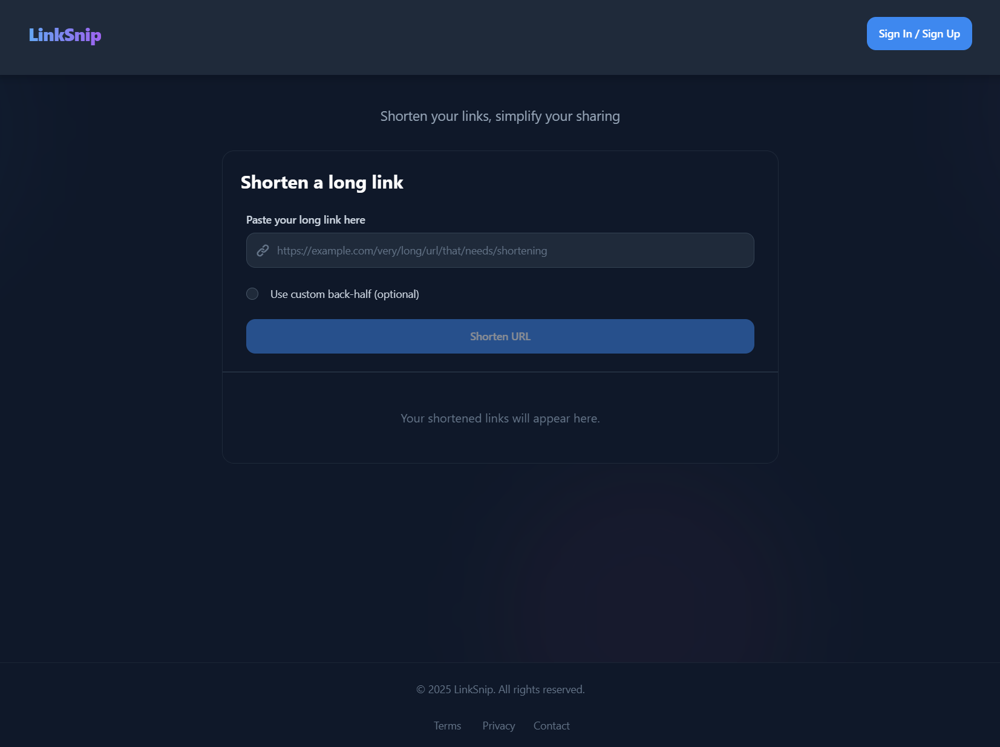
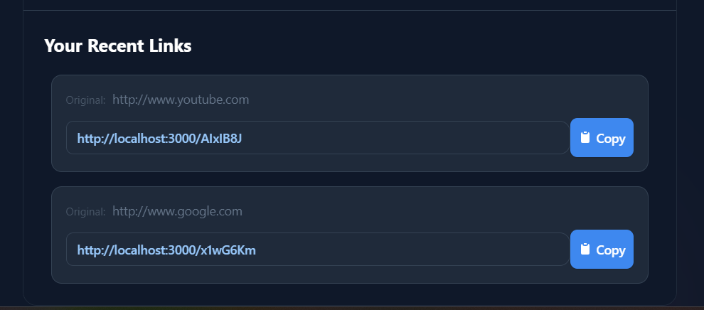
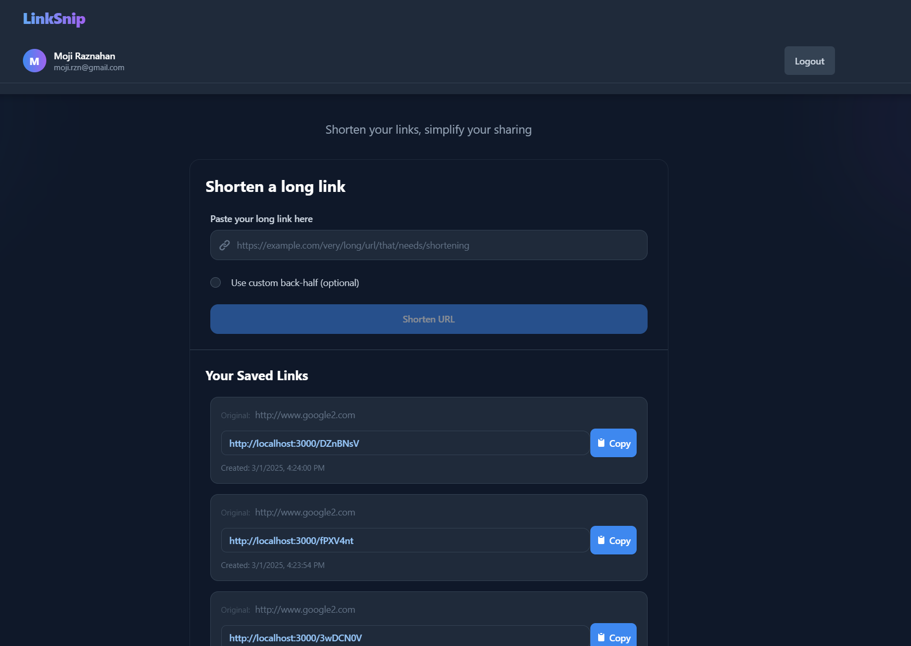
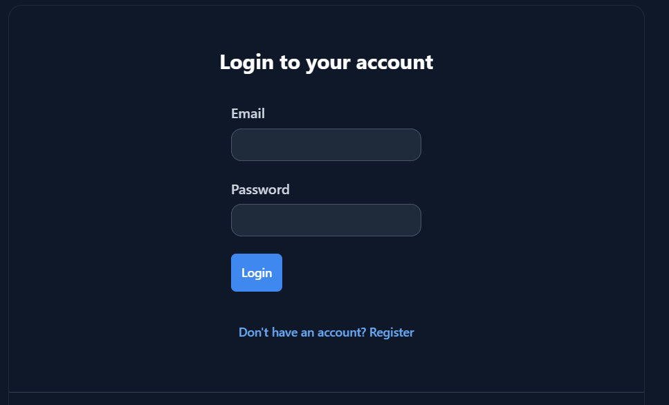
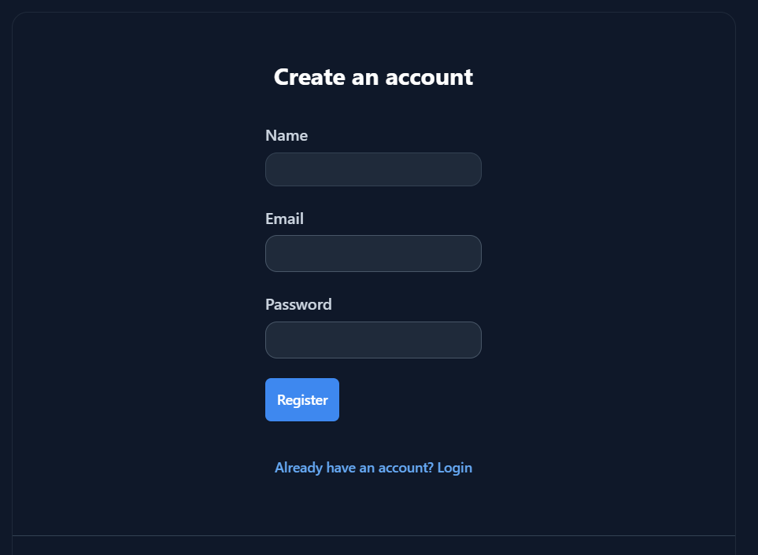

# URL Shortener Application

A shortener application that allows users to create shortened URLs and manage their links.



## Features

- **URL Shortening**: Create shortened URLs with optional custom aliases
- **User Authentication**: Secure login and registration system
- **Link History**: View and manage your previously shortened URLs
- **Copy to Clipboard**: One-click copy functionality for shortened URLs
- **Responsive Design**: Works seamlessly on desktop and mobile devices
- **Custom Aliases**: Create memorable custom short URLs
- **Anonymous Usage**: Create shortened URLs even without an account
- **Persistent Storage**: Links are saved to your account when logged in

## Screenshots









## Tech Stack

- **Frontend**: React.js, TypeScript, Redux, Tailwind CSS
- **Backend**: Node.js, Express.js, TypeScript
- **Database**: MongoDB
- **Authentication**: JWT (JSON Web Tokens)
- **Deployment**: Docker, Docker Compose

## Getting Started

### Prerequisites

- Node.js (v14 or higher)
- npm or yarn
- MongoDB
- Docker and Docker Compose (optional, for containerized deployment)

### Installation

1. Clone the repository
```bash
git clone https://github.com/raznahan/LinkSnip.git
cd url-shortener-app
```

2. Install dependencies for both frontend and backend
```bash
# Install backend dependencies
cd backend
npm install

# Install frontend dependencies
cd ../frontend
npm install
```

3. Set up environment variables
   - Create a `.env` file in the root directory

Example `.env`:
```
MONGODB_URI=mongodb://localhost:27017/url-shortener
JWT_SECRET=your_jwt_secret
PORT=5000
NODE_ENV=development
FRONTEND_URL=http://localhost:3000
BASE_URL=http://localhost:5000
```

4. Start the development servers

Using npm:
```bash
# Start backend
cd backend
npm run dev

# In a new terminal, start frontend
cd frontend
npm start
```

Using Docker:
```bash
# Start both frontend and backend with Docker Compose
docker-compose up
```

5. Open your browser and navigate to `http://localhost:3000`

## API Endpoints

| Method | Endpoint | Description |
|--------|----------|-------------|
| POST | /api/auth/register | Register a new user |
| POST | /api/auth/login | Login a user |
| POST | /api/url/shorten | Create a new short URL |
| GET | /api/url/user | Get all URLs for a user |
| GET | /:slug | Redirect to the original URL |

## Deployment

### Using Docker

The application includes Docker configuration for easy deployment:

1. Make sure Docker and Docker Compose are installed on your system
2. Configure environment variables in the `.env` file
3. Build and start the containers:
```bash
docker-compose up -d
```

### Manual Deployment

1. Build the frontend:
```bash
cd frontend
npm run build
```

2. Build the backend:
```bash
cd backend
npm run build
```

3. Deploy the built applications to your preferred hosting service

## License

This project is licensed under the MIT License - see the LICENSE file for details.